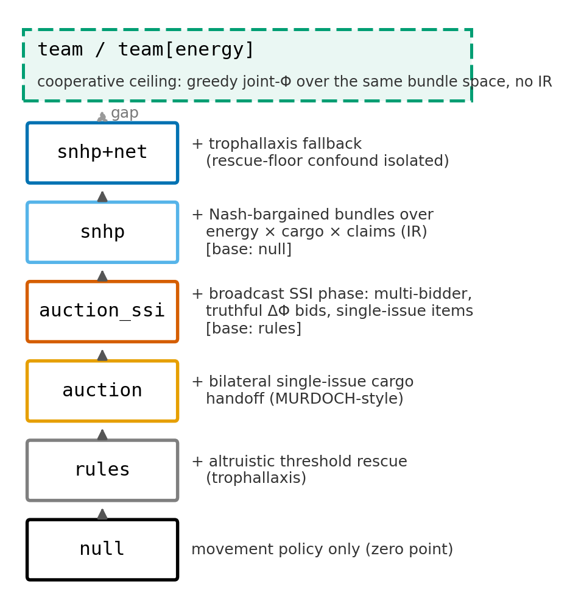
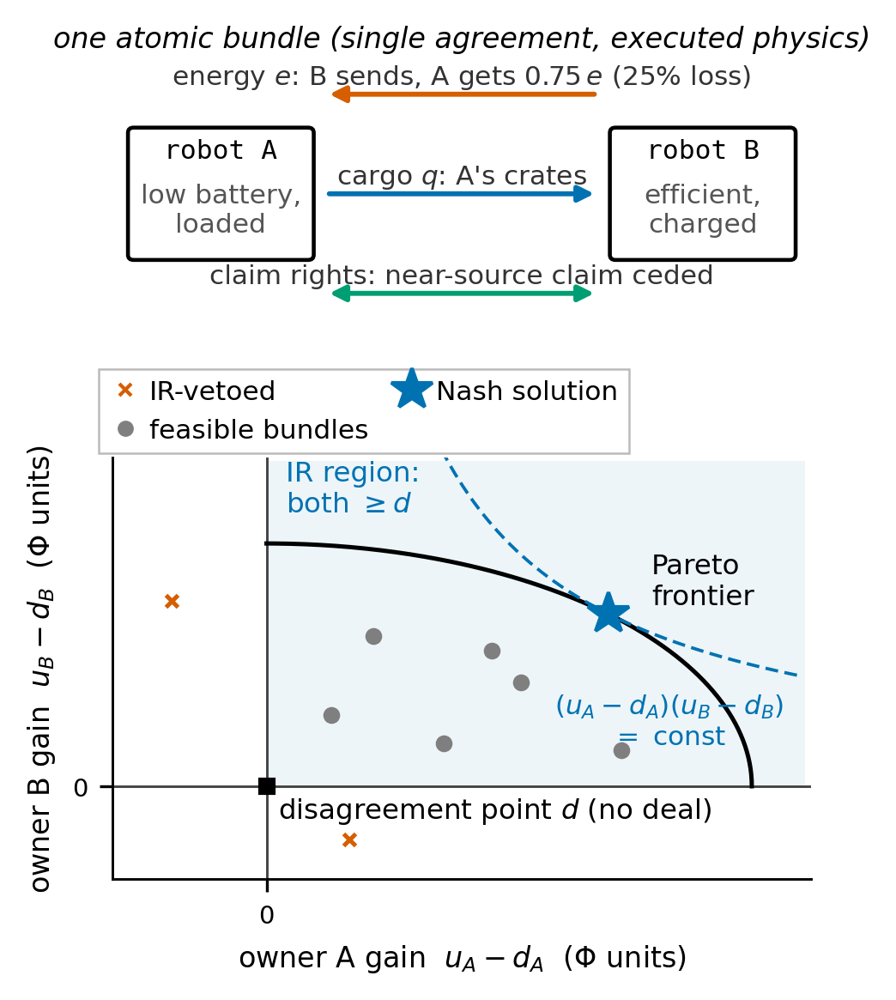
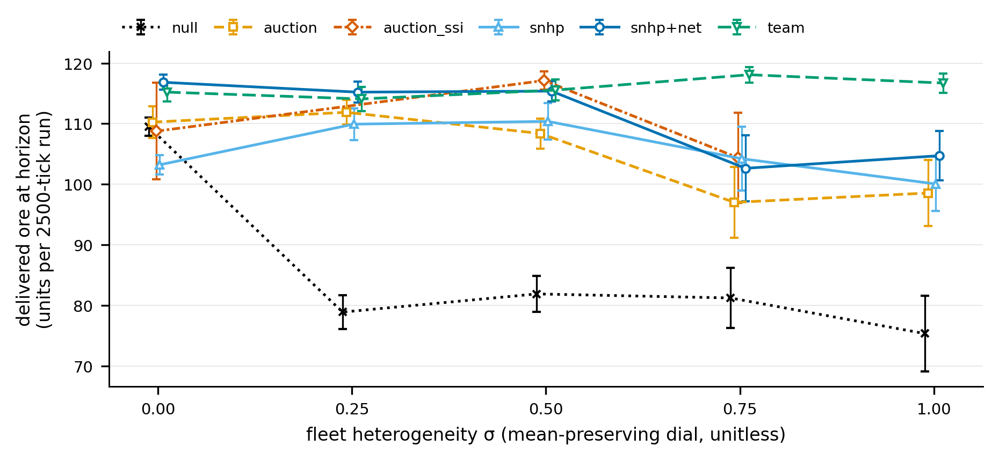
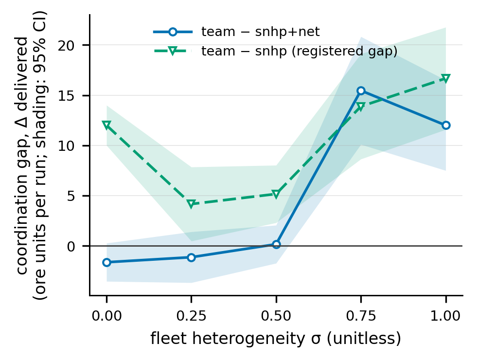
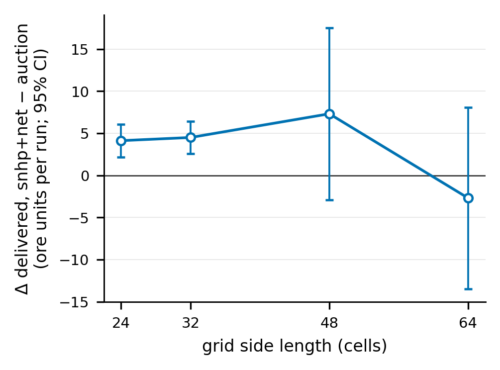
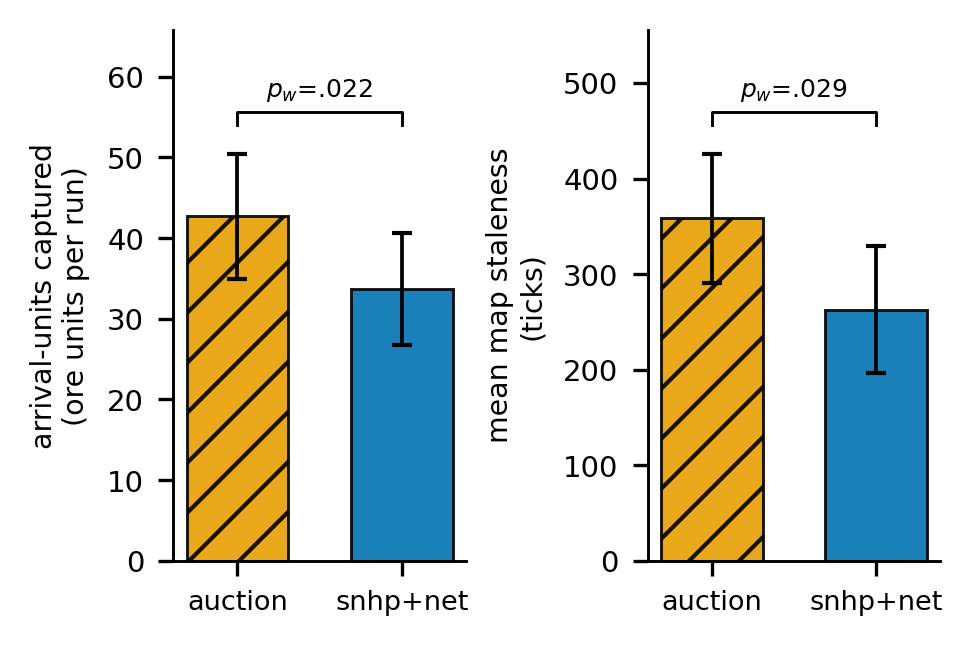
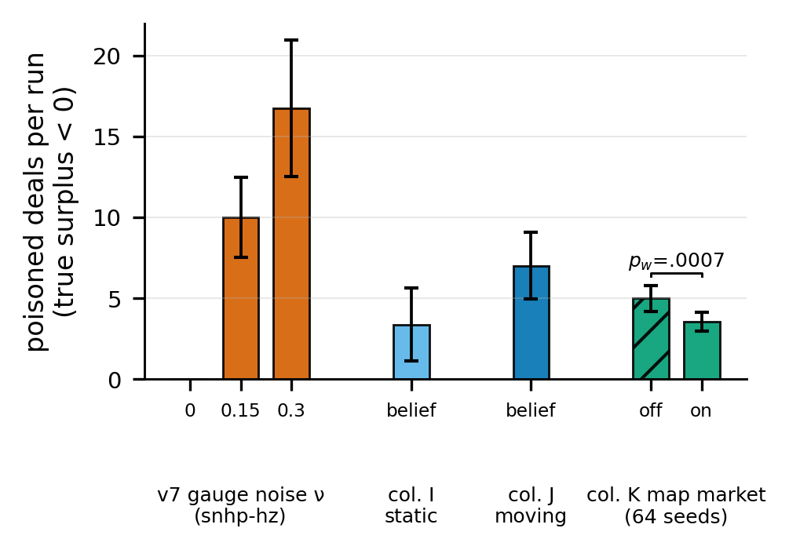

# Bundling or Silence: A Pre-Registered Benchmark of Multi-Issue Nash Bargaining in Mixed-Ownership Robot Fleets

*Manuscript draft for founder review — NOT for submission as-is. All numbers
are quoted from research/swarm/RESULTS.md, research/swarm/SPEC.md, and
research/swarm/SPEC-ADDENDUM-2026-07-23.md; all references verified
(REFERENCES-VERIFIED.md, 2026-07-23; four sources abstract-level only, caveat
retained in §2). Revised 2026-07-23 against review/PAPER-REVIEW-2026-07-23.md;
LaTeX at paper/main.tex; companion-paper outline in PAPER2-OUTLINE.md.*

**Alternative titles:**

1. *Multi-Issue Bargaining as a Coordination Mechanism for Self-Interested Robot Fleets: A Benchmark*
2. *The Coordination Gap: Multi-Issue Bargaining versus Auctions and Central Planning in Mixed-Ownership Robot Fleets*

---

## Abstract

Twenty-four robots owned by different parties mine ore and haul it to a
sink in a deterministic gridworld, under battery budgets, lossy energy
transfer, and a fixed horizon. Robots can strike bundled deals trading
energy, cargo, and territory claims. Owners differ, so every deal must be
individually rational (IR): no side accepts a loss. We benchmark
Nash-bargained bundles against altruistic rescue, bilateral and broadcast
sequential single-item (SSI) auctions, and a cooperative ceiling, under a
mean-preserving heterogeneity dial. Three claims were registered before
results. C1: single-issue IR trade is structurally infeasible — only
bundles trade. C2: bargaining with a rescue floor out-delivers the
bilateral auction on two geometries; against the strong SSI baseline a
registered kill fired — bargaining buys survival, not throughput. C3: the
bargaining−auction gap grows with heterogeneity, then saturates. On moving
fields, auction coverage out-explores bargaining; a map-information market
improves audit integrity, not output. Our first registration failed hostile
review; every fired kill is reported.

---

## 1. Introduction

Robot deployments increasingly cross ownership boundaries: delivery fleets
in facilities owned by others, robots from different vendors sharing
chargers, mixed fleets in one warehouse. This is commercial practice, not a
hypothetical — robots-as-a-service contracts already price physical work
per outcome (AutoStore bills warehouse picks per pick; GXO pays Agility
Robotics for humanoid labor by utilization), so a coordination step between
robots with different owners is also a commercial event between firms. The
standard premise of multi-robot coordination — one shared objective — is
then false by construction. Each robot answers to its owner, and any step that leaves an
owner worse off will eventually be disabled. Coordination must be
*individually rational* (IR): no participant accepts a loss.

The market-based multi-robot lineage [2, 3, 4] saw this early and imported
the auction: tasks are announced, robots bid, the cheapest capable robot
wins. But a bid is one scalar. It cannot express the deal mixed-ownership
logistics needs — "I take your two crates because I am efficient and you
are nearly dead; you top up my charge and cede your claim on the near
source." Multi-issue negotiation (logrolling) is mature in the automated
negotiation community [13, 14], yet an adversarially verified literature
sweep (Section 2) found no published system in which robots strike bundled
multi-issue agreements with each other.

This paper contributes a benchmark, not a deployment: a controlled world in
which the bargaining layer's value can be isolated, measured, and killed.
Three registered questions: is bundling *necessary* for IR trade (C1)? How
much of the cooperative ceiling does bundled Nash bargaining recover — the
residual being the *coordination gap* (C2)? Does the advantage over
single-issue auctions grow with heterogeneity (C3)?

Two objections deserve pre-emption. First, with known utilities the Nash
bargaining solution is a computation, not a protocol; the benchmark
therefore treats information quality as a variable, and under estimation
error and lies (v5–v7) the mechanism's measured value is *deal integrity* —
the true-loss veto turns error into failed proposals — not cleverness.
Second, our agents are simulated too; what separates them from the
negotiation literature's is not hardware but where utilities come from.
Issue values are computed by executing the candidate deal in the world's
dynamics — movement costs, the 25% transfer loss, time-consuming exchanges,
stranding — not drawn from exogenous preference tables; hence the
evaluated-Φ==executed-Φ assertion on every deal. We call this *physically
grounded*.

Positioning: this is market-based multi-robot / MAS work, not swarm robotics
— N=24, full-information utilities, and a deterministic gridworld fail the
field's own criteria for "swarm" [22], and we use the word only to say so.
All claims were pre-registered with explicit kill conditions before results
— including a v1 registration that failed hostile review and was discarded
(Section 3.4) — and fired kills are reported as results, not buried.

## 2. Related Work

This section follows an adversarially verified prior-art map (20 primary
sources fetched; 25 claims checked by 3-vote panels: 23 confirmed 3-0, 2
refuted; LITERATURE.md in the code release). Its verdict: the intersection
of multi-issue negotiation and inter-robot coordination is unoccupied.

**Market-based multi-robot coordination is single-issue.** MURDOCH [2]
assigns tasks by first-price one-round auctions; a bid is one scalar
fitness value. TraderBots [5] extends auctions to task trees, but a bid
remains task + price + tree — a full-text search of the thesis (187 pp.)
finds no Nash, logrolling, multi-issue, bargaining, or energy exchange. The
MRTA taxonomy [3] and the Dias et al. survey [4] frame the field's
mechanisms; none bundle issues. Later robotics "negotiation" stays
single-issue: task reallocation [7]; opponent-utility modeling for task
allocation [8].

**Multi-issue IR contracting among self-interested agents is not new.**
Sandholm's contract types [26] give self-interested agents *cluster*
(bundle) contracts, *swaps*, and multi-agent contracts with side payments
under IR; each escapes local optima the others cannot, and atomic OCSM
contracts reach the global optimum in theory. Andersson and Sandholm [27]
sequence contract types for anytime reallocation. Multiagent resource
allocation (MARA) covers the same ground over abstract goods: Chevaleyre et
al. [28] survey allocation by negotiation; Endriss et al. [29] characterize
the deal classes — including multilateral bundle deals — needed for
socially optimal allocations under IR. Our absence claim is therefore
narrow: missing is a *physically grounded* instantiation with
*heterogeneous physical issue types* — lossy energy vs cargo vs claim
rights, each with its own dynamics — under *executed dynamics*, benchmarked
empirically rather than proved as reachability results. That gap is the one
this benchmark occupies.

**Two terminology traps.** *Combinatorial bids are not multi-issue deals*:
Lin and Zheng [6] auction bundles of *tasks* at one scalar price per bundle
— one issue type, no cross-issue trade-off. *Nash equilibrium is not Nash
bargaining*: a 2025 EAAI paper [9] applies Nash *equilibrium* analysis to a
non-cooperative task-selection game — no offers, no deals, no exchange;
energy sits inside each robot's own utility. From the other direction, the
2026 line applying the Nash bargaining solution to vehicle-to-vehicle
energy markets (e.g., arXiv:2605.22363) bargains one issue — price/quantity
of energy — over purely economic utilities. Keyword searches
("combinatorial," "Nash, robots, energy") wrongly suggest the niche is
occupied.

**Robot-robot energy exchange exists in hardware, but is rule-based.** The
CISSBot line demonstrates physical battery swapping [10] under Ngo and
Schiøler's probabilistic "randomized trophallaxis" [32] — no offer or
acceptance step. Moonjaita et al. [11] fix roles by battery thresholds and
amounts by energy averaging: numerically an egalitarian split, no agreement
struck. Virtual trophallaxis [12] couples energy to navigation as
signaling. The physical channel our benchmark abstracts exists; the
bargaining layer above it does not.

**The negotiation community never crossed into robot-robot coordination.**
ANAC ran 2010–2015 entirely in the Genius simulator over table-defined
preference profiles; the organizers' retrospective [13] contains zero
occurrences of robot, embodied, or physical, and the 2015 roadmap targeted
marketplaces, energy markets, telecom. ANAC 2025 [14] remains virtual, with
LLM integration as the forward direction. The only robotics crossover is
dyadic human-robot *social* negotiation [15] — not an inter-robot
primitive.

**LLM × multi-robot work is single-dimension dialogue.** MARLIN [16]
negotiates the next joint movement; consensus-seeking agents [17] converge
on one shared value; AgenticPay [18] is price-only; CLiMRS [19] forms
subgroups, not issue-bundled deals; a 2025 embodied-AI survey [20] does not
contain negotiation, auction, or bargain in its accessible text.
RoCo/CoELA-style dialogue for multi-robot planning (RoCo, ICRA 2024) is the
closest structural neighbor — dialogue over sub-task plans and joint
motion, not issue-bundled trades. At survey level, the CSUR MRTA review
[21] lists no negotiation, bargaining, logrolling, or multi-issue technique
(abstract and reference list checked via open mirror; full text paywalled).

**What remains unclaimed** (and what this benchmark occupies): (i) a
*physically grounded* system in which ≥2 robots strike one agreement
bundling ≥2 *heterogeneous physical issue types* (lossy energy, cargo,
claim rights) under executed dynamics; (ii) the Nash *bargaining solution*
[1] (not Nash equilibrium) between robots; (iii) an empirical benchmark of
such deals against auction and rule baselines. Honest limits:
absence-of-evidence structure (an occupant could hide in an unindexed
venue, non-English literature, or unqueried vocabulary — "multi-attribute
contracting," "OCSM," "resource allocation by negotiation," "barter,"
"resource exchange protocol"); four load-bearing sources [7, 8, 9, 21]
remain below full-text verification after a second pass (2026-07-23: all
four paywalled; abstracts, the CSUR reference list, and an open-access 2026
survey in the same intersection contain no contradiction); the most
plausible hidden occupant remains RoCo/CoELA-style dialogue making de facto
multi-issue trades without negotiation vocabulary; Klein/Faratin
complex-contract threads were not exhaustively checked for physically
grounded instantiations. Current to mid-2026.

## 3. The Benchmark

### 3.1 World

The base world (v2) is a 32×32 deterministic gridworld: two ore sources (16
and 40 Manhattan from the sink), one sink, one 2-slot charger dispensing 4
energy/tick, 120 ore units, a 2500-tick horizon, N=24 robots interacting
within Chebyshev distance 2. Movement costs energy (more when loaded);
inter-robot energy transfer loses 25%; each executed deal debits 0.05
battery per side. A robot is *stranded* at battery < 5 more than one cell
from the charger. Later stages extend the world without changing the
dynamics discipline: two companies with refineries and a refining tariff τ
(v4); a rich ecology — 10 asteroids, 4 company-owned chargers with guest
pricing, 240 units, lean fleets (v5); non-stationary contested fields with
seeded arrivals and departures (v11–v12).

Heterogeneity is a **mean-preserving σ dial**: capacity = 3 + σU(−2,2);
efficiency = 1 + σU(−0.5,0.5) clipped to [0.5,1.5]; battery = 60 +
σU(−40,40) clipped to [10,100]. Fleet means (3, 1.0, 60) are σ-invariant,
test-pinned. This repairs a v1 flaw: σ was confounded with poverty (fleet
energy fell ~40% as σ rose), making "heterogeneity" claims partly scarcity
claims.

### 3.2 The arm ladder

One mechanism is added per rung, so adjacent rungs differ by exactly one
mechanism:

| arm | = | mechanism added |
|---|---|---|
| `null` | movement policy only | — (the zero point) |
| `rules` | null + trophallaxis | altruistic threshold rescue (Moonjaita-style [11]) |
| `auction` | rules + cargo handoff | MURDOCH-style bilateral single-issue scalar reassignment [2] |
| `auction_ssi` | rules + broadcast SSI phase | sequential single-item broadcast auction, Koenig lineage [30]: multi-bidder competition, truthful ΔΦ bids, single-issue items by construction (added at review; registered pre-run in the 2026-07-23 addendum) |
| `team` | null + greedy joint-Φ | cooperative ceiling: argmax(Φa+Φb) over the same bundle space, no IR |
| `team[energy]` | team, energy only | strong Φ-informed single-issue baseline |
| `snhp` | null + Nash bundles | IR bargaining: Nash bargaining solution over bundles, strictly positive surplus both sides |
| `snhp+net` | snhp + trophallaxis fallback | isolates the removed-rescue confound |

**Figure 1.** The arm ladder: one mechanism per rung, null → rules → auction
→ auction_ssi → snhp → snhp+net, with team / team[energy] as the
cooperative-ceiling rail. `[base: x]` tags mark rungs whose base is not the
previous rung (auction_ssi = rules + SSI; snhp = null + bundles).

Bundles combine three issues — energy, cargo, and sector/claim rights — in
a discrete contract space (7×7×2 in the rich stage); Figure 2 shows one
executed bundle. Bundle evaluation and execution share one code path;
evaluated Φ == executed Φ is asserted on every deal. `auction_ssi` shares
every discipline with the other rungs (same item magnitudes, same 1.1
clearing hysteresis, same transaction cost, pause, cooldowns) and differs
from `auction` by exactly {broadcast multi-bidder, energy-as-item,
sequential rounds}; an item is exactly a (q,0,0) or (0,e,0) bundle, so the
arm structurally cannot logroll (asserted in code). Later rungs add
hazard-priced risk (`-hz`), career-value pricing (`-lv`, `-lvc`), company
walls, and a trust-gated joint tier (Section 4.5). The `team` arm exists
because hostile review showed a trivial selfless control can dominate a
bargaining arm; every bargaining claim faces both the auctions below and
the ceiling above.

**Figure 2.** One executed bundle between two robots: the three issue axes
(energy transfer with 25% loss, cargo, claim rights) and the utility-gain
space with the IR region, disagreement point, Pareto frontier, and
Nash-product hyperbola. Geometry illustrative; the loss rate and issue space
are the spec constants of Sections 3.1–3.2.

### 3.3 Metrics

Primary: **delivered ore at the fixed 2500-tick horizon** — never a ratio
whose denominator shrinks when robots die (Section 3.4). Strandings are
first-class: every headline is also reported as score_k = delivered −
k·stranded at k ∈ {0, 2, 5}, after an audit showed the agents internally
price a stranded drone at 1.5 ore while the scoreboard priced it at 0.
Secondaries: energy efficiency metered to the last delivery, lost cargo,
deal counts, multi-issue fraction, per-deal capture. Statistics: paired t
and Wilcoxon on 24 seeds (16 in later columns), wins/n, Holm within
families; makespan reported but not tested where horizon censoring
dominates.

### 3.4 Registration protocol — and the v1 failure as method

The v1 headline claims failed hostile review: the efficiency metric
*rewarded fleet death* (dead robots stop drawing charge; one run stranded
all 24 robots, delivered less than the auction, and scored "a 5.8× win"); a
trivial greedy joint-Φ control beat the bargaining arm on every metric at
every σ; and the single-issue ablation struck zero deals — the failure that
became C1. SPEC v2 was re-registered on 2026-07-14, *before any v2
results*, with claims C1–C3, the mean-preserving dial, the cooperative
ceiling as a mandatory arm, delivered-at-horizon as primary, and explicit
WIN/PARTIAL/KILL outcomes; every later extension (v3–v12, columns A–K, and
review-response columns R1/GB/SSI) was registered pre-run with its own kill
condition. A 2026-07-15 replay review then found two physics artifacts that
22 automated passes had missed — a cargo trap whose rescue subsidized our
own mechanism by ~40% of the then-current bargaining-vs-auction gap, and
temporally free deals; all columns were re-run, several verdicts shrank or
died, and Section 4 reports post-correction numbers (detail, including a
charger livelock, in Appendix A).

## 4. Results

All verdicts are read against their pre-registrations. Sweep sizes: v2.1
888 runs; v3 960; v4.0 1944; v4.1 544; v5 736; v6–v7 480; columns G–K 16
seeds/cell; R1 (384 runs, 64 seeds), GB (360), SSI (216) per the 2026-07-23
addendum, whose headline test is Wilcoxon (p_w).

### 4.1 C1 — bundling is necessary under individual rationality

Registered prediction P1 (single-issue snhp arms strike 0 deals at every σ)
**holds as amended**. Energy-only trade is structurally impossible: with
25% transfer loss and selfish utilities the donor always loses. Cargo-only
trade exists solely as *distress jettison* (~0.5 deals/run): a
near-stranded loaded robot gains by shedding load. Both are pinned as test
invariants. In the full arms, ~98–99% of struck deals are multi-issue
(per-run range 86–100%; HEAD-physics artifact `sweep_v2.1_head.json`). The
cooperative form did **not** survive the physics correction: on the HEAD
re-pin (R4), `team` beats `team[energy]` only at σ=0.75 (+1.62, p_w=.014;
elsewhere −0.7 to +2.5, n.s.) — once deals cost time, extra bundle
dimensions stop paying at the cooperative ceiling. The rebuttal of
"single-issue suffices" rests on the structural IR half of C1 alone; the
pre-correction "+1.8 to +17.1, significant at 4 of 5 σ" figure is retired
to the correction history.

C1 recursed one level up: in the column-K information market (Section 4.7),
a map-sync whose net value to the buyer is negative (bad news only) is
IR-vetoed by construction; bad news trades only when bundled with enough
good news to clear the veto. Single-issue bad news is unsellable; bundled
truth trades.

### 4.2 C2 — sufficiency and the coordination gap

Every C2 comparison names its baseline: against the **bilateral
MURDOCH-style handoff auction** (`auction`) bargaining wins delivered;
against the **broadcast SSI auction** (`auction_ssi`) it does not — a
registered kill (below, and Section 4.4).

All harsh-world numbers are the HEAD-physics re-pin (R4, registered
2026-07-23; artifact `sweep_v2.1_head.json`, 888 runs; the 2026-07-14
artifact is history only). `snhp+net` beats `auction` at every σ (+3.33 to
+7.00 delivered; p_w≤.014 at σ ∈ {0, 0.25, 0.5}, p_w=.052 at σ=0.75,
p_w=.011 at σ=1.0), with k2/k5 gaps larger and significant at every σ
(σ=0.5 k5 +25.96, p_w=.0001) — the registered R4-C2 ordering, WIN. The
v2.1-era ceiling inversion (119.6 vs 105.9 at σ=0) survives only in
survival form: under HEAD the σ=0 delivered edge over `team` is +1.62
[−0.27, +3.52] (p_w=.11 at 24 seeds; +1.77, p_w=.026 at the 64-seed R1a
re-pin), carried by strandings (2.6 vs 4.1; k5 +9.58, p_w=.0002 at 64
seeds); the hive wins delivered outright at σ≥0.75 (−15.46/−12.00,
p_w≤.0002). `snhp` beats `null` at every σ≥0.25 (+23.0 to +31.0, 23–24/24
seeds, p_w≤.0001) but **loses at σ=0** (−6.29 [−8.61, −3.97], p_w=.0001,
2/24): twin fleets have no gains from trade, so bargaining is pure overhead
— as theory demands. Corrected honest negatives: at σ≤0.5 pure `snhp`
still never beats the auction on delivered (the low-σ win requires the
rescue floor; at σ=0.75 it now does, +7.21, p_w=.0089); the pre-correction
"net hurts at σ=0.75" tax (99.3 vs 90.4) was a physics artifact — under
HEAD it vanishes (snhp − snhp+net = +1.58, n.s.) and the net helps
significantly at every other σ.

**Figure 3.** Delivered-at-horizon vs σ (mean ± 95% CI, 24 seeds/cell) for
null, auction, auction_ssi, snhp, snhp+net, and team on the HEAD-physics
v2.1 grid (`sweep_v2.1_head.json`); the auction_ssi series is from
`sweep_v4_SSI.json` (σ ∈ {0, 0.5, 0.75} only).

The **coordination gap** (team − snhp on delivered; registered as "price of
selfishness," renamed here) is real at every σ and grows past mid-σ: 12.0 →
4.2 → 5.2 → 13.9 → 16.7 as σ goes 0→1 (HEAD re-pin; all p_w≤.048).
Registered prediction P3 (that it *shrinks* with σ) remains **refuted**: the
gap dips at mid-σ, then grows. The gap is not the price of anarchy [31]:
PoA bounds worst-case *equilibrium* welfare against the *optimum*, whereas
ours is the measured difference between one IR mechanism and a greedy
joint-utility heuristic — neither an equilibrium notion nor an optimum
bound (the ceiling itself is non-optimal, Section 6). It is an empirical
gap for this world and ladder, not a named theoretical quantity.

**Figure 4.** The coordination gap vs σ: paired Δ delivered with 95% CI
bands for *both* definitions — team − snhp (the registered gap, formerly
"price of selfishness"; this is the curve the text's 12.0 → 4.2 → 5.2 →
13.9 → 16.7 numbers refer to) and team − snhp+net (the survival-form
comparison against the safety-netted arm). The two diverge sharply at
σ ≤ 0.5, where the rescue floor does most of its work.

The physics correction shrank but did not kill the bilateral comparison on
the rich stage: snhp-hz +3.4 (p=.005, was +9.6 — ~40% of the old gap was
the pad subsidy), positive at every counterparty-noise level (+0.8..+4.1,
p≤.024; the v5 noise dial found no crossover — the true-loss veto turns
estimation error into failed proposals, not bad deals); on k-scores only
the safety-net arm survives (snhp+net vs auction +4.5 delivered, +20.4 at
k=5, both significant). The "market beats the hive" claim, re-pinned at 64
seeds (R1a, WIN): +1.77 delivered [+0.32, +3.21], p_w=.026, strandings 2.27
vs 3.83, k5 +9.58, p_w=.0002; the seeds-0..15 subset reproduces the
previously unversioned 16-seed numbers essentially exactly (+2.12,
p_w=.041). On richer stages the hive wins at every k. The scoped law: *the
safety-netted market beats central planning when survival is the binding
constraint; the hive wins when logistics are.*

**Two-geometry replication (R2/column GB: WIN).** On geometry B — sources
at Manhattan 32/24 in opposite quadrants (no cheap 16-hop source, no 40-hop
death-march), refinery mid-edge, mid-field charger, non-mirrored —
(snhp+net − auction) delivered is positive at every σ: +6.42 (p_w=.0002) at
σ=0, +3.83 (p_w=.0038, 18/24) at σ=0.5, +4.42 (p_w=.0007, 19/24) at σ=1.0,
with no k2 reversal (σ=0.5 k5 +26.96, p_w=.0001). The ladder ordering
replicates descriptively. Nuance, reported as registered: on B the hive is
*not* edged on raw delivered at σ=0 (118.8 vs 119.5, at the 120 ceiling) —
but team strands 9.17 vs 0.96, so the net dominates every k-score; the
survival form of the law holds on both maps. The bilateral comparison in C2
is a two-geometry result.

**The strong-market test (R3/column SSI: KILL FIRED).** The registered
prediction that snhp+net out-delivers SSI at σ≥0.5 died in its strong form:
auction_ssi *significantly beats* the bargaining arm on delivered at σ=0.5
(−1.75 [−3.48, −0.02], p_w=.038; σ=0.75 −1.75, n.s.). The SSI market pays
in strandings: snhp+net wins score_k5 at σ=0.75 (+12.42, p_w=.027) and
dominates the k-scores at the σ=0 sanity cell (k2 +19.92, k5 +37.67, both
p_w≤.0001). The kill was earned against a real opponent: auction_ssi beats
the bilateral auction by +8.75 (p_w=.0001) at σ=0.5 and +7.38 (p_w=.045)
at σ=0.75. The honest statement of C2: *against a strong market baseline,
bargaining buys survival, not throughput* — the fourth time a strengthened
market matched or beat bargaining on raw output while losing on fleet
survival (v3 hazard pricing, v9 career pricing, the v11 moving field, now
SSI).

### 4.3 C3 — heterogeneity scaling

Registered prediction P4 (snhp − bilateral auction grows monotonically in
σ) is **partial** and survives the HEAD re-pin (R4-C3, WIN): −7.0 → −2.0 →
+2.0 → +7.2 → +1.5 delivered across σ ∈ {0, 0.25, 0.5, 0.75, 1.0}
(`sweep_v2.1_head.json`) — point-estimate monotone over σ=0→0.75 (a
14.3-unit swing, ~60% smaller than the pre-correction 36.6; +7.21 at
σ=0.75, p_w=.0089), saturating or breaking at σ=1.0. The break is
unexplained (candidates: robots no deal can salvage; charger binding); we
do not claim full monotonicity. The σ=0 end is now significantly negative
(−7.04, p_w=.0001): twin fleets have nothing to trade, so bargaining is
overhead on this world; in the two-company v4 world at σ=0 all mechanisms
statistically tie `null` (post-correction) — the same
no-heterogeneity-no-gains prediction at each world's cost structure. The
strongest effect is the two-company v4 world: snhp beats auction
+15.5/+15.0 delivered at σ=0.5/1.0 (p<0.001, 22–23/24 seeds)
pre-correction; +14.1 (p<.001) on the corrected v4 preset. Geometry
scoping: the gap's *sign* at σ≥0.5 replicates on geometry B (Section 4.2),
but the five-point gradient is geometry-A only — on B the gap is already
significant at σ=0 (+6.42, p_w=.0002; B's distances keep charging
economics binding even for twin fleets), so the growth-with-σ shape
remains a geometry-A result.

### 4.4 Killed claims (reported as registered)

The registered kill conditions fired repeatedly; the decision-relevant
deaths are listed inline.

- **"Beats the market lineage" (R3/column SSI): KILL FIRED, the strong
  form.** The broadcast SSI baseline significantly out-delivers snhp+net at
  σ=0.5 (−1.75, p_w=.038) and never loses on delivered at σ≥0.5, while
  snhp+net keeps the survival-adjusted scores (k5 +12.42, p_w=.027 at
  σ=0.75). Registered consequence, applied without spin: every C2 delivered
  claim names its baseline — the bilateral MURDOCH-style handoff — and no
  general "beats the market lineage" language survives (numbers in Section
  4.2). Structural note: auction_ssi is single-issue by construction and
  cooperative (truthful ΔΦ bids, no payments); its awards are not IR (the
  losing side eats a negative ΔΦ whenever 1.1×|loss| < gain), so C1 —
  single-issue *IR* trade is infeasible — stands untouched.
- **Hazard-priced risk as a substitute for the rescue floor (v3): killed.**
  Both registered kill triggers fired (snhp-hz ≤ snhp at σ=0.25, −8.4,
  p=0.034; the net still added +22.8/+25.1 delivered at σ≤0.25). The
  surviving v3 "regime law" (risk pricing wins when risk is heterogeneous)
  then **died under corrected physics**: its crossing was largely the
  pad-subsidy artifact (best remaining edge +3.6, p=.17, with 15–21
  strandings vs the net's 2–7).
- **Career-value drone pricing (v9/column H): kill fired.** Pricing drones
  at their remaining mining career made late-game drones disposable
  (delivered −16.5, p=.023; stranded +7.3, p=.001 vs flat pricing). With a
  capital floor it set the fastest selfish makespan recorded (688) and tied
  the net on delivered (239.6) — but still lost score_k=5 by −36 (p=.001).
  Three attempts to replace the rescue floor with a smarter market (v3, v6,
  v9) died on pre-registered criteria: *the safety net's edge is
  institutional, not a pricing bug.*
- **The density theory (v8/column G): killed as stated.** "Dense fields
  favor auction, sparse favor bargaining" was replaced by a hump: snhp+net
  − auction = +4.1 (grid 24) → +4.5 (32) → +7.3 (48) → −2.7 (64). A market
  needs enough logistics friction to be worth paying for and enough meeting
  density to convene. Single-geometry; scoped accordingly.
- **"Cooperation is 43% faster": died under corrected physics.** Once deals
  cost time, the joint tier's speed edge is ~9% n.s.; the dividend moved to
  survival (gated fleets end 1.06 stranded vs the veto tier's 15.31).

**Figure 5.** The v8 hump (single geometry; v5 preset, σ=0.5, 16
seeds/cell): (snhp+net − auction) delivered vs grid side 24/32/48/64,
paired Δ with 95% CI whiskers (+4.12 / +4.50 / +7.31 / −2.69).

### 4.5 Deception and self-knowledge error: scoping note

The program's integrity results belong to a companion paper
(PAPER2-OUTLINE.md); here they are only scoped. The v6.0 registered kill
fired informatively: Nash-IR bargaining with a true-loss veto is
intrinsically deception-tolerant — lying barely pays because every executed
deal clears both true disagreement points; exploitation requires the
trusting joint tier, where attestation gating drops the liar advantage to
statistical zero. v7 showed self-knowledge error (a miscalibrated gauge)
leaves output flat while silently signing deals at negative true surplus.
The relevance to C2: the bargaining tier's IR guarantee is exactly as good
as each robot's knowledge of its own state, and information quality was a
treated variable, not an assumption.

### 4.6 Column J — the moving field inverts a headline

On static fields, perfect field information was never load-bearing (column
I: oracle − belief = +0.2 delivered, n.s.; the registered whole-column kill
fired). Column J removed the crutches: seeded arrivals nobody knows about,
departures that leave ghosts on stale maps, contested unmirrored ground.

- **P16a failed as registered**: oracle − belief on delivered is +11.4,
  directional but n.s. at 16 seeds (p=.15). The *significant*
  information-value channel is the books: belief-mode signs +7.0 more
  truly-harmful deals per run (p=.0004).
- **P16b inverted, significantly**: the auction, with substantially staler
  maps (358.4 vs 262.8 ticks at the 64-seed re-pin, p_w=.029; 16-seed: 305
  vs 190), captures *more* of the newly arrived stock: +8.98 [+0.44,
  +17.52], p_w=.022 (42.7 vs 33.7 units/run) at 64 seeds (R1c, WIN);
  16-seed original 46.2 vs 32.4, p=.03 — shrank from +13.8 but holds.
  Discovery needs physical coverage: the deal economy converges robots onto
  known-profitable loops, while the auction's inefficient wandering is
  accidental exploration.
- **Exploratory, flagged post-hoc**: on the moving contested field the
  auction out-delivers every coordination arm on raw gold (snhp+net −12.6,
  p=.044 at 16 seeds; +10.19, p_w=.011 at 64 seeds — reported but never
  registered, so it stays post-hoc) while k2/k5 remain a wash (+7.1 n.s. /
  +2.5 n.s.: the auction pays its gold edge in dead drones). The discovery
  gap explains the delivered gap almost exactly (13.8 arrival-units ≈ 12.6
  delivered at 16 seeds). **Optimization buys blindness to novelty**: the
  bargaining advantage is a known-field phenomenon; novelty-rich worlds
  reward coverage over coordination.

**Figure 6.** The column-J inversion at the 64-seed re-pin (R1c cells of
`sweep_v4_R1.json`; moving + contested + belief-mode, no scouting or map
market): arrival-units captured (42.70 vs 33.72, p_w=.022) and mean map
staleness (358.4 vs 262.8 ticks, p_w=.029), auction vs snhp+net. The arm
with fresher maps captures *less* of the new stock — freshness ≠ discovery.

### 4.7 Column K — scouting fixes discovery; the map market fixes the books

Column K priced the unknown. The discovery deficit died to *policy*, not
markets: two scouts per company erased the auction's explorer edge
(arrivals gap −13.8, p=.03 → −3.4, n.s.; delivered 284.1 vs 286.6) and made
the oracle redundant (282.8 vs 284.1 — with patrols, information is free
again). A Nash-priced map market (40 executed syncs/run) added nothing to
discovery (−0.7, p=1.0) but **cut poisoned deals ~30%** — re-pinned at 64
seeds (R1b, WIN): **5.00 → 3.53 (−29%), p_w=.0007** (16-seed original: 5.38
→ 3.75, p=.04), with delivered a descriptive wash (+4.53, p_w=.46):
*traded information's product is audit integrity, not output.* The
registered bad-news trap (P17c) confirmed structurally: bad-news-only syncs
are IR-vetoed; bundled truth trades (Section 4.1). Prospecting claims
produced measurable patrol differentiation (staleness 22.7 vs 25.4 inside
vs outside own claims) with zero output effect at this scale.

**Figure 7.** Poisoned deals per run (executed at negative true surplus for
an honest party) across the program's error sources: v7 gauge noise
(ν ∈ {0, 0.15, 0.3}; snhp-hz, no margin, 32 seeds), column I static-field
beliefs (16 seeds), column J moving-field beliefs (16 seeds), and column K
map market off/on at the 64-seed re-pin (5.00 → 3.53, Δ=+1.47
[+0.69, +2.24], p_w=.0007). Output stays flat in every condition; only the
books move.

## 5. Discussion

**Mechanism choice for cross-organization fleets is regime-dependent, and
the regimes are now mapped.** Bundling is necessary for any IR trade (C1,
structural). Bargaining plus an unconditional rescue floor out-delivers a
bilateral handoff auction on two geometries and, on survival-bound worlds,
edges past the cooperative ceiling (C2); against the broadcast SSI lineage
its edge is survival-priced, not throughput — continuous with the standing
result that the safety net's value is institutional. The advantage needs
heterogeneity (C3), mid-range logistics friction with enough encounter
density (the v8 hump, single-geometry), and a *known* field (column J).
Where those fail, simpler mechanisms win honestly: coverage beats
coordination on novelty-rich ground, SSI competition matches bargained
throughput, and central planning wins when logistics rather than survival
bind. For an operator: choose by what binds — throughput (a strong auction
suffices), fleet survival (bargaining + a rescue floor), or discovery
(coverage/scouting policy).

**The border result is the deployment-relevant one.** Two firms bargaining
at their boundary statistically match a full merger (team 118.6 vs twofirm
117.6, n.s., corrected physics); selfless cross-company transfers are
net-harmful; posted-price infrastructure tolls collapse against a
bargaining fleet (peak toll revenue −63%, 72.1 → 26.8). You do not need to
merge fleets — you need a bargaining layer at the boundary, with IR keeping
the border priced rather than closed or exploited.

**The integrity thread is deliberately excluded.** Across four error
sources — lies (v6), gauge miscalibration (v7), stale maps (v10), a moving
field (v11) — output stays flat while individual books silently bleed, and
column K's map market heals books, not output. That finding and its
settlement-infrastructure implications form the companion paper
(PAPER2-OUTLINE.md).

## 6. Limitations

This is a mechanism benchmark; hardware grounding is future work.

- **Scale**: N=24 (16–24 seeds per cell) is a multi-robot economy, not a
  swarm; by Şahin's criteria [22] no swarm claim is made or licensed.
- **Deterministic gridworld**: physical grounding here means
  world-dynamics-derived utilities, not hardware — there are no kinematics,
  collisions, sensor/actuation noise, or comms dropout, and noise-free
  simulation results are presumed non-transferable across the reality gap
  [25] until shown otherwise.
- **Full-information utilities**: robots know their own Φ exactly (v7
  perturbs one input); counterparty utilities are estimated only in v5+.
  Strategic information revelation and opponent learning are touched only
  through the registered lie and noise channels.
- **Deal-space abstraction**: energy transfer (lossy, minutes), cargo
  handoff (precision docking), and claim swaps (instant, free) have very
  different hardware time constants and failure modes; treating them as
  commensurable in one atomic bundle needs justification before any
  hardware claim.
- **Static-vs-moving scoping**: the headline bargaining advantages hold on
  static or slowly-changing fields; column J shows the ordering can invert
  under non-stationarity. Claims are scoped accordingly.
- **Statistical power and geometry**: the three previously fragile headline
  numbers were re-pinned at 64 seeds (R1, all WIN) and the C2 bilateral
  comparison replicates on a second geometry (R2); but 16-seed columns
  still leave directional results unresolved (P16a: +11.4, p=.15), the v8
  hump and later-column findings remain single-geometry, and the C3
  σ-gradient shape is geometry-A only. Exploratory findings are flagged and
  must not be cited as registered.
- **Mechanism instantiations**: the auction lineage has two rungs
  (bilateral MURDOCH-style and broadcast SSI [30]), but combinatorial
  variants are untested; the cooperative ceiling is greedy joint-Φ, not an
  optimal planner, so the coordination gap is measured against a heuristic,
  not an optimum.

## 7. Reproducibility

The pipeline is deterministic and seed-pinned. Code and artifacts are
released as a self-contained repository at
`github.com/ryuxik/bundling-or-silence` (public at publication; Apache-2.0;
the 174-test suite passes on a clean clone; source hashes in
`PROVENANCE.md`).
The world, arms, and runner are `world.py`, `arms.py`, `run.py`; every
column is
regenerated by `run.py --column <A..K|R1|GB|SSI>` then `run.py --analyze
<sweep.json>` (v2.1/v3 via `run.py` directly; review-response numbers print
from the committed `repin_report` path, not notebooks). Sweep artifacts
(per-run rows with seeds, arm configs, event logs) are committed under
`research/swarm/results/` (e.g. `sweep_v2.1.json`, 888 runs;
`sweep_J.json`/`sweep_K.json`, 16 seeds/cell; `sweep_v4_R1.json`, 384 runs
at 64 seeds; `sweep_v4_GB.json`, 360 runs; `sweep_v4_SSI.json`, 216 runs).
The test suite (`pytest test_swarm.py`, 174 tests green as of the addendum)
pins the structural claims (C1 zero-deal invariants, σ mean-preservation,
evaluated==executed dynamics, attested-all ≡ honest-all bit-identity, the
auction_ssi single-issue assertion) and regression-pins the corrected
physics. Disclosure: the bargaining primitives
(`generate_contract_space`, `filter_pareto_frontier`,
`find_nash_bargaining_solution`) are the authors' deployed production
negotiation engine's code, reused unmodified — deliberately, so the
benchmark exercises the code path that ships. Pre-registrations,
amendments, and fired kills are timestamped in `SPEC.md` and
`SPEC-ADDENDUM-2026-07-23.md` (verdicts appended after runs; registrations
never edited); the hostile v1 review, the standards brief, and the
2026-07-23 referee review are in `review/`.

## Appendix A: the physics corrections (detail)

The 2026-07-15 replay review found: (1) a *pad-strand cargo trap* — a robot
arriving at its target facility could strand on the arrival step and hold
its cargo forever; rescue-capable arms ransomed that cargo back at 94–100%
vs ~64% for auction/rules, a differential subsidy to our own mechanism
worth ~40% of the then-current bargaining-vs-auction gap; and (2)
*temporally free deals* — robots kept driving mid-exchange. Fixes:
facilities unload on arrival (same tick); every executed exchange
immobilizes both parties for DEAL_PAUSE=3 ticks. A third audit finding
motivated the k-score policy: the scoreboard priced a dead drone at k=0
while the agents priced it at 1.5 ore internally, so every headline is
reported at k ∈ {0, 2, 5}. Separately, a 22-agent pre-merge review found a
*charger livelock* in the v7 column (the queue-release threshold read
believed battery while the cap uses true battery, parking robots with gauge
bias < −0.05 at chargers forever; reproduced 3×) plus a second unintended
perturbation channel; both were fixed, regression-pinned, and columns D/E/F
re-run, with pre-fix numbers struck in the results file.

## References

*ACM-format entries merged from REFERENCES-VERIFIED.md (bibliographic pass
2026-07-23). † = full text not inspected (publisher paywalled; abstract-level
evidence only — disclosure in Section 2). Remaining pre-camera-ready
spot-checks: [6] pages/DOI and [26] pages (reproduced from standard records,
not re-verified); the ACM article number of [21] (unfindable without
authenticated ACM DL access — cited as "28 pages" per ACM style).*

1. John F. Nash. 1950. The Bargaining Problem. *Econometrica* 18, 2 (April 1950), 155–162. https://doi.org/10.2307/1907266
2. Brian P. Gerkey and Maja J. Matarić. 2002. Sold!: Auction Methods for Multirobot Coordination. *IEEE Transactions on Robotics and Automation* 18, 5 (Oct. 2002), 758–768. https://doi.org/10.1109/TRA.2002.803462
3. Brian P. Gerkey and Maja J. Matarić. 2004. A Formal Analysis and Taxonomy of Task Allocation in Multi-Robot Systems. *International Journal of Robotics Research* 23, 9 (Sept. 2004), 939–954. https://doi.org/10.1177/0278364904045564
4. M. Bernardine Dias, Robert Zlot, Nidhi Kalra, and Anthony Stentz. 2006. Market-Based Multirobot Coordination: A Survey and Analysis. *Proceedings of the IEEE* 94, 7 (July 2006), 1257–1270. https://doi.org/10.1109/JPROC.2006.876939
5. Robert Michael Zlot. 2006. *An Auction-Based Approach to Complex Task Allocation for Multirobot Teams.* Ph.D. Dissertation. Carnegie Mellon University, Pittsburgh, PA.
6. Lin Lin and Zhiqiang Zheng. 2005. Combinatorial Bids Based Multi-Robot Task Allocation Method. In *Proceedings of the 2005 IEEE International Conference on Robotics and Automation (ICRA 2005)*. IEEE, 1145–1150. https://doi.org/10.1109/ROBOT.2005.1570270
7. † Rongxin Cui, Ji Guo, and Bo Gao. 2013. Game Theory-Based Negotiation for Multiple Robots Task Allocation. *Robotica* 31, 6 (Sept. 2013), 923–934. https://doi.org/10.1017/S0263574713000192
8. † Wende Ke, Zhiping Peng, Quande Yuan, Bingrong Hong, Ke Chen, and Zesu Cai. 2012. A Method of Task Allocation and Automated Negotiation for Multi Robots. *Journal of Electronics (China)* 29, 6 (Nov. 2012), 541–549. https://doi.org/10.1007/s11767-012-0868-x
9. † Ali Hamidoğlu, Omer Melih Gul, Seifedine Nimer Kadry, Chiranjibe Jana, Ali Elghirani, and Gokhan Koray Gultekin. 2025. A Cost-Effective Nash-Based Allocation Method for Task Distribution of Multiple Robots in Distributed Robotic Networks. *Engineering Applications of Artificial Intelligence* 162 (Dec. 2025), Article 112548. https://doi.org/10.1016/j.engappai.2025.112548
10. Henrik Schiøler and Trung Dung Ngo. 2008. Trophallaxis in Robotic Swarms — Beyond Energy Autonomy. In *Proceedings of the 2008 10th International Conference on Control, Automation, Robotics and Vision (ICARCV 2008)*. IEEE, 1526–1533. https://doi.org/10.1109/ICARCV.2008.4795751
11. Choladawan Moonjaita, Hemma Philamore, and Fumitoshi Matsuno. 2018. Trophallaxis with Predetermined Energy Threshold for Enhanced Performance in Swarms of Scavenger Robots. *Artificial Life and Robotics* 23, 4 (Dec. 2018), 609–617. https://doi.org/10.1007/s10015-018-0497-z
12. Thomas Schmickl and Karl Crailsheim. 2008. Trophallaxis within a Robotic Swarm: Bio-Inspired Communication among Robots in a Swarm. *Autonomous Robots* 25, 1–2 (Aug. 2008), 171–188. https://doi.org/10.1007/s10514-007-9073-4
13. Tim Baarslag, Reyhan Aydoğan, Koen V. Hindriks, Katsuhide Fujita, Takayuki Ito, and Catholijn M. Jonker. 2015. The Automated Negotiating Agents Competition, 2010–2015. *AI Magazine* 36, 4 (Dec. 2015), 115–118. https://doi.org/10.1609/aimag.v36i4.2609
14. Reyhan Aydoğan, Tim Baarslag, Tamara C. P. Florijn, Katsuhide Fujita, Catholijn M. Jonker, and Yasser Mohammad. 2026. The Automated Negotiating Agents Competition (ANAC) 2025 Challenges and Results. arXiv:2604.13914.
15. Reyhan Aydoğan, Mehmet Onur Keskin, and Umut Çakan. 2022. Would You Imagine Yourself Negotiating with a Robot, Jennifer? Why Not? *IEEE Transactions on Human-Machine Systems* 52, 1 (Feb. 2022), 41–51. https://doi.org/10.1109/THMS.2021.3121664
16. Toby Godfrey, William Hunt, and Mohammad Divband Soorati. 2024. MARLIN: Multi-Agent Reinforcement Learning Guided by Language-Based Inter-Robot Negotiation. arXiv:2410.14383.
17. Huaben Chen, Wenkang Ji, Lufeng Xu, and Shiyu Zhao. 2023. Multi-Agent Consensus Seeking via Large Language Models. arXiv:2310.20151.
18. Xianyang Liu, Shangding Gu, and Dawn Song. 2026. AgenticPay: A Multi-Agent LLM Negotiation System for Buyer-Seller Transactions. arXiv:2602.06008.
19. Siqi Song, Xuanbing Xie, Zonglin Li, Yuqiang Li, Shijie Wang, and Biqing Qi. 2026. Leveraging Adaptive Group Negotiation for Heterogeneous Multi-Robot Collaboration with Large Language Models (CLiMRS). arXiv:2602.06967.
20. Zhaohan Feng, Ruiqi Xue, Lei Yuan, Yang Yu, Ning Ding, Meiqin Liu, Bingzhao Gao, Jian Sun, Xinhu Zheng, and Gang Wang. 2025. Multi-Agent Embodied AI: Advances and Future Directions. arXiv:2505.05108.
21. † Athira K. A., Divya Udayan J., and Umashankar Subramaniam. 2024. A Systematic Literature Review on Multi-Robot Task Allocation. *ACM Computing Surveys* 57, 3 (Nov. 2024), 28 pages. https://doi.org/10.1145/3700591
22. Erol Şahin. 2005. Swarm Robotics: From Sources of Inspiration to Domains of Application. In *Swarm Robotics* (Lecture Notes in Computer Science, Vol. 3342). Springer, 10–20. https://doi.org/10.1007/978-3-540-30552-1_2
23. Manuele Brambilla, Eliseo Ferrante, Mauro Birattari, and Marco Dorigo. 2013. Swarm Robotics: A Review from the Swarm Engineering Perspective. *Swarm Intelligence* 7, 1 (March 2013), 1–41. https://doi.org/10.1007/s11721-012-0075-2
24. Heiko Hamann. 2018. *Swarm Robotics: A Formal Approach.* Springer, Cham. https://doi.org/10.1007/978-3-319-74528-2
25. Nick Jakobi, Phil Husbands, and Inman Harvey. 1995. Noise and the Reality Gap: The Use of Simulation in Evolutionary Robotics. In *Advances in Artificial Life (ECAL 1995)* (Lecture Notes in Computer Science, Vol. 929). Springer, 704–720. https://doi.org/10.1007/3-540-59496-5_337 — and Nick Jakobi. 1997. Evolutionary Robotics and the Radical Envelope-of-Noise Hypothesis. *Adaptive Behavior* 6, 2 (1997), 325–368. https://doi.org/10.1177/105971239700600205
26. Tuomas Sandholm. 1998. Contract Types for Satisficing Task Allocation: I. Theoretical Results. In *Proceedings of the AAAI Spring Symposium: Satisficing Models*. AAAI Press, 68–75.
27. Martin R. Andersson and Tuomas W. Sandholm. 1999. Sequencing of Contract Types for Anytime Task Reallocation. In *Agent Mediated Electronic Commerce* (Lecture Notes in Computer Science, Vol. 1571). Springer, 54–69. https://doi.org/10.1007/3-540-48835-9_4
28. Yann Chevaleyre, Paul E. Dunne, Ulle Endriss, Jérôme Lang, Michel Lemaître, Nicolas Maudet, Julian Padget, Steve Phelps, Juan A. Rodríguez-Aguilar, and Paulo Sousa. 2006. Issues in Multiagent Resource Allocation. *Informatica* 30, 1 (2006), 3–31.
29. Ulle Endriss, Nicolas Maudet, Fariba Sadri, and Francesca Toni. 2006. Negotiating Socially Optimal Allocations of Resources. *Journal of Artificial Intelligence Research* 25 (2006), 315–348. https://doi.org/10.1613/jair.1870
30. Sven Koenig, Craig Tovey, Michail Lagoudakis, Evangelos Markakis, David Kempe, Pinar Keskinocak, Anton Kleywegt, Adam Meyerson, and Sonal Jain. 2006. The Power of Sequential Single-Item Auctions for Agent Coordination. In *Proceedings of the 21st National Conference on Artificial Intelligence (AAAI 2006)*. AAAI Press, 1625–1629.
31. Elias Koutsoupias and Christos Papadimitriou. 1999. Worst-Case Equilibria. In *STACS 99* (Lecture Notes in Computer Science, Vol. 1563). Springer, 404–413. https://doi.org/10.1007/3-540-49116-3_38
32. Trung Dung Ngo and Henrik Schiøler. 2007. Randomized Robot Trophallaxis: From Concept to Implementation. In *2007 IEEE International Conference on Systems, Man and Cybernetics (SMC 2007)*. IEEE, 208–213. https://doi.org/10.1109/ICSMC.2007.4414153

---

## Submission notes (not part of the manuscript)

**Recommended venue.** AAMAS full paper, per the standards brief's venue
analysis and the 2026-07-23 referee review (which estimates a credible full
paper after the blocking fixes — now applied — with the two-paper split).
This manuscript is Paper 1 of that split; Paper 2 (the integrity results) is
outlined in PAPER2-OUTLINE.md. The 8-page limit still cannot hold columns
A–K: the AAMAS version should carry C1/C2/C3 + the registration/correction
method + the SSI and geometry-B results + the column J/K scoping, with v4
compressed to a table and the full program in an arXiv appendix. JAAMAS (no
page pressure) fits if the founder wants the whole program in one artifact;
arXiv-first timestamps the absence claim and, given the notary GTM's
"research frozen until buyer conversations" rule, may be the only compatible
near-term move — the review concurs ("the timestamp matters more than the
venue").

**Must be done before submission:**

1. **Pre/post-correction number policy: RESOLVED (2026-07-23).** The paper
   uses post-correction numbers only (founder decision); every pre-
   correction RESULTS.md section now carries a SUPERSEDED banner; pre-
   correction figures appear in the paper only inside explicit correction-
   history narration (§3.4, §4.3's v4 sentence, retired figures named as
   such in §4.1/§4.2).
2. **RESOLVED (2026-07-23): sweep_v2.1.json was NOT post-correction** — it
   and sweep_v3.json (both 2026-07-14) predate CORRECTION 2. Both grids
   were regenerated cell-for-cell under HEAD physics per addendum R4
   (`sweep_v2.1_head.json`, 888 runs; `sweep_v3_head.json`, 960 runs);
   §4.1/§4.2/§4.3 now cite only the HEAD artifacts. R4-C2 and R4-C3 both
   WIN (orderings survive; magnitudes shrink); two v2.1-era side claims
   died and are reported as corrected: snhp>null flipped at σ=0 (−6.29,
   p_w=.0001), and team−team[energy] collapsed to n.s. except σ=0.75.
3. Figures: **fig1–fig7 DONE (2026-07-23)** — generated deterministically by
   `figures/make_figures.py` (vector PDF + 300-dpi PNG) and wired into
   §3–§4 with captions. Still on the wishlist, not yet made: the SSI
   delivered-vs-k5 contrast and geometry A/B map schematics.
4. Citations: **merged (2026-07-23)** from REFERENCES-VERIFIED.md in ACM
   format (Andersson–Sandholm LNCS details filled; [10] trophallaxis split
   resolved — ICARCV 2008 for the CISSBot demo, new [32] SMC 2007 for
   "randomized trophallaxis"; [15] year 2022; [21] Nov. 2024). Remaining:
   spot-check the ○-REPRODUCED classics before camera-ready; [21]'s ACM
   article number needs authenticated ACM DL access; the four †-sources
   stay abstract-level after a second paywalled pass (disclosure updated in
   §2); do not cite the two refuted sweep claims (ANAC-tactics import; CSUR
   reference-list).
5. Code release: pin the SPEC hash in artifact metadata; regenerate all
   artifacts from the released commit; `pytest test_swarm.py` green on a
   clean clone; license. (Engine-reuse disclosure now stated plainly in
   Section 7 per review M5 — founder to confirm wording.)
6. Statistics pass: exact p-values and effect sizes with CIs throughout
   (R1/GB/SSI numbers already carry CIs; earlier columns do not); confirm
   Holm families as registered; keep the 25-test disclosure of Section 4.2.
7. Draft Paper 2 from PAPER2-OUTLINE.md; the settlement-infrastructure
   discussion lives there (one paragraph, flagged as motivation), not in
   Paper 1.
8. LaTeX: `paper/main.tex` + `paper/refs.bib` exist (acmart sigconf as a
   stand-in — swap to the official IFAAMAS class at submission; author
   block TBD; figures pulled from `../figures/*.pdf`).
